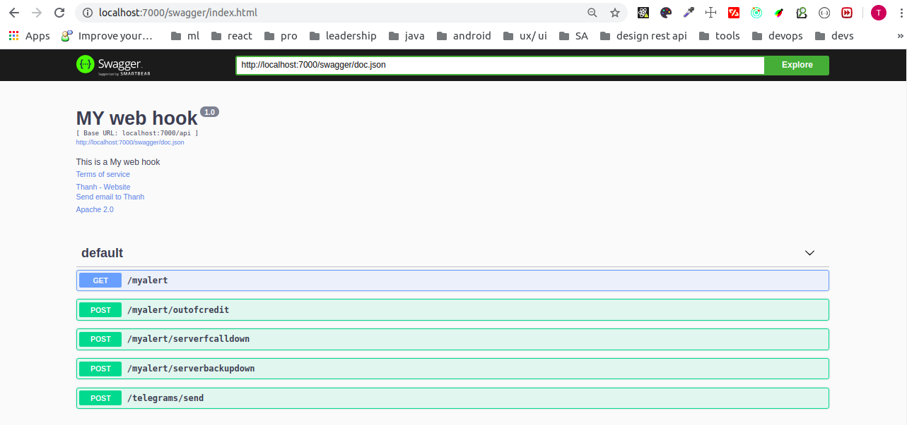

## Web hook

This is a project, that is built to support kibana alerting itegrate with other system. It's reposibility is a middleware between kibana alerting and other system 
````
Note: other system in this use case are Remote and autoticket
````

## Quickly
nohup go run main/main.go &

## File Structure

Within the download you'll find the following directories and files:
```bash
.
├── go.mod
├── go.sum
├── main
│   ├── api
│   │   ├── AOPTBot.go
│   │   ├── api.go
│   │   ├── AutoticketBot.go
│   │   └── TelegramBot.go
│   ├── docs
│   │   ├── alertingOutOfCredit.md
│   │   ├── alertingServerBackupDown.md
│   │   ├── alertingServerFcallDown.md
│   │   ├── docs.go
│   │   ├── sendTelegram.md
│   │   ├── swaggerui.png
│   │   └── welcome.md
│   ├── dto
│   │   ├── Account.go
│   │   ├── AOPTGetCommandBody.go
│   │   ├── AOPTGetCommandResponse.go
│   │   ├── AOPTGetStatusBody.go
│   │   ├── AOPTGetStatusResponse.go
│   │   ├── AOPTRunCommandBody.go
│   │   ├── AOPTRunCommandResponse.go
│   │   ├── AOPTRunServiceBody.go
│   │   ├── AOPTRunServiceResponse.go
│   │   ├── AutoticketBody.go
│   │   ├── AutoticketResponse.go
│   │   ├── MyObject.go
│   │   ├── Notification.go
│   │   ├── ResultDTO.go
│   │   └── TokenDTO.go
│   ├── main
│   ├── main.go
│   ├── utils
│   │   ├── ApiUtils.go
│   │   ├── FileUtils.go
│   │   └── TimeUtils.go
│   ├── variable
│   │   └── Variable.go
│   ├── web
│   │   └── handler.go
│   └── webhook.yaml
├── README.md
└── vendor
    ├── github.com
    │   └── swaggo
    │       ├── files
    │       ├── gin-swagger
    │       │   ├── b0x.yml
    │       │   ├── go.mod
    │       │   ├── go.sum
    │       │   ├── LICENSE
    │       │   ├── README.md
    │       │   └── swagger.go
    │       └── swag
    │           ├── cmd
    │           │   └── swag
    │           │       └── main.go
    │           └── license
    └── vendor.json

```
## API description
* [Swagger UI]() `GET /swagger/index.html`

* [Welcome](main/docs/welcome.md): `GET /api/myalert`
* [Alert Out Of Credit](main/docs/alertingOutOfCredit.md) `POST /api/myalert/outofcredit`
* [Alert Server Fcall Down](main/docs/alertingServerFcallDown.md) `POST /api/myalert/serverfcalldown`
* [Alert Server Backup Down](main/docs/alertingServerBackupDown.md) `POST /api/myalert/serverbackupdown`
* [Send Message To Telegram](main/docs/sendTelegram.md) `POST /api/telegrams/send`
## Technical Support or Questions
If you have questions or need help integrating the product please "thanh29695@gmail.com" instead of opening an issue.

